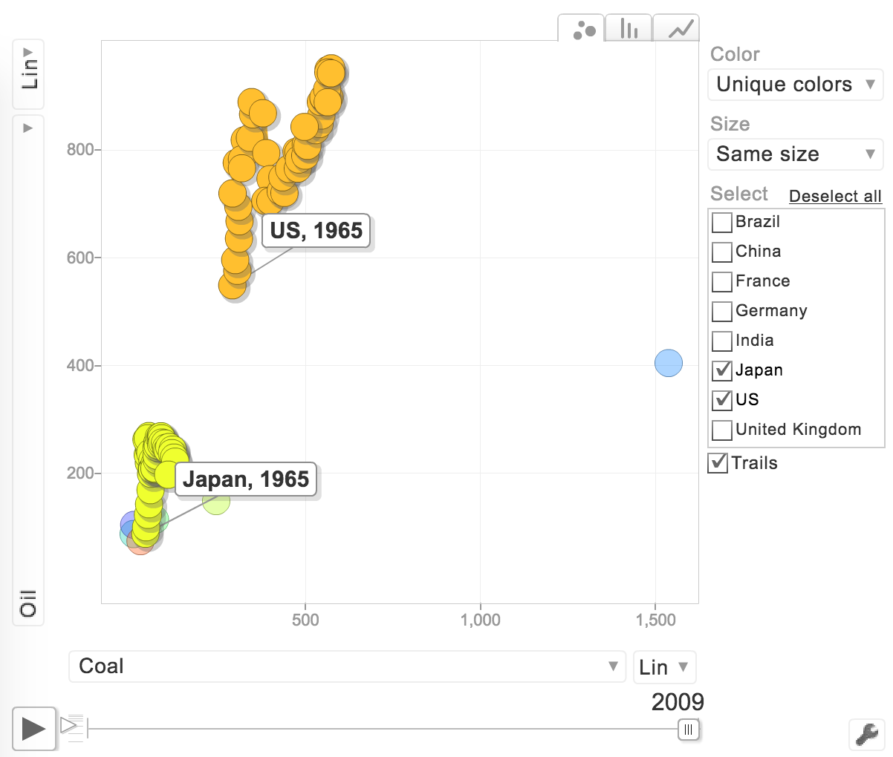

## Assignment 1

We start out by importing olive oil data from `olive.csv` into R and try to _"classify oils using decision trees by treating Region as response and all acids as explanatory variables"_. We plot the decision tree below.

```{r,echo=FALSE,message=FALSE,warning=FALSE}
library(rpart)
library(partykit)
#library(classifly)
#library(rggobi)
library(XLConnect)
library(googleVis)
library(fields)
library(animation)
ani.options(ffmpeg= "C:\\ffmpeg-20161007-c45ba26-win64-static\\bin\\ffmpeg.exe")

olive <-read.csv("olive.csv")
olive$Region <- as.factor(olive$Region)
tree <- rpart(Region ~ palmitic + palmitoleic + stearic +
                oleic + linoleic + linolenic + arachidic +
                eicosenoic, data = olive)
plot(as.party(tree))
#classifly(olive,Region ~ palmitic + palmitoleic + stearic +
#            oleic + linoleic + linolenic + arachidic +
#            eicosenoic,rpart)
```

We can see that actually none of the oils were misclassified, meaning that the acid variables used for decision-making were very well chosen. In our case, we used linoleic and eicosenic acids and the tree is very shallow.

Let us use these two acids and make a classifly plot in order to demonstrate the decision boundaries.


We see that the low and high eicosenic acid content clusters are well-defined, but the separation between low and high linoleic acid content clusters is not easy to detect by clustering, since there is no significant separation between them.

We now scale our data and _"perform a complete-link hierarchical clustering using all acids as explanatory variables."_ We plot the resulting dendrogram.

```{r,echo=FALSE}
olivescaled <- scale(olive[,4:11])
olive_dist <- dist(olivescaled)
olive_dend <- hclust(olive_dist, method = "complete")
plot(olive_dend)
threeclusters <- cutree(olive_dend, k = 3)
olive$three <- as.factor(threeclusters)
#write.csv(olive,file = "oliveout.csv")
```

From the picture,weI suppose one could say there are about four or five "natural clusters" in the dendrogram. However, the assignment calls for making a cut in the tree at the height where there are three clusters and performing a 2D-tour on the data colored after these three clusters in RGgobi. The first histogram shows the relative number of observations in the three clusters created.


A 2D-tour using three variable acids.


A 2D-tour using three variable acids.


A 2D-tour using all variable acids.

To us, although the result is most likely a proper clustering, this clustering definitely seems less efficient than the one achieved using a decision tree. In fact, one can still clearly make out the distinct clusterings based on linoleic and eicosenic acid content.

## Assignment 2

We import the data over total oil and coal consumption in million tonnes oil equivalent in eight large countries from year 1965 to year 2009 from `OilCoal.xls` and create a motion chart using R package `Googlevis`.





It can be noticed that China had a rapid increase in the consumption of oil and coal throughout the whole observation period (1965-2009). There was a dramatic rise in coal and oil consumption from 2002 to 2009. China is known to be the largest coal producer in the world as they use coal as a main source of energy. It accounts for half of the global coal consumption. The increase in both oil and coal consumption might also due to the rise in population growth in the country.
 
In 1973, the consumption of oil in US, Japan, France, Germany and United Kingdom rapidly dropped. At that time, there was an event called the 1973 oil crisis that made the price of oil rise more than four times. This crisis was later called the first oil shock. This year also coincides with the inventory-led recession of 73-74 in the U.S. The second oil shock happened during 1979. There was an Iranian revolution which affect the oil output and hence the oil price. The consumption of oil decreased in all countries except India as a consequence of the doubling in the price of crude oil. Later, inflation countermeasures by the fed around 1981 also helped to suppress the oil consumption in the economy.

We believe that the european mature economies of France, Germany and the U.K. all have similar oil and coal consumption over time. However, it is not easy to make out form the motion chart so we try to confirm this by making a couple of time series plots.


Not only do we see that there is a high correlation in coal and oil consumption between the three countries, we also notice that the coal consumption has gone down by alot over time in all three countries. One of the major explaining factors is the rise of the alternative energy sources such as the natural gas and renewable power (e.g., solar and wind energy).

Even though the time series plots were helpful in this case,we believe it is easier to intuitively grasp the development over time and the sizes of the relative changes in energy consumption in this motionchart compared to a combination of induvidual time series plots per country.

Now we fit a thin plate spline model to the data and choose as the response the percentage of oil consumed out of total oil and coal energy consumption and as the predictors the variables `Year` and `Country`. Then, for each time point, we _"create a bar plot with stacked bars in which one bar corresponds to one country,
and each bar is subdivided into percentages of using oil and coal in the country (i.e.,
each bar has total length 100%)"_ and make an animation out of this over time.

Here are the snapshots of said animation at the start and the finish.


Throughout the animation, one can see that the oil/coal consumption ratio for China stays about the same throughout, despite the previously shown massive increase in both oil and coal consumption. This was not obvious in the motion chart and should count as an advantage. Disadvantage is that it is less interesting to look at an animated barplot compared to an animated motion chart and you will probably not catch the attention of your audience equally well.

```{r,echo = FALSE}
#wb = loadWorkbook("Oilcoal.xls")
#oilcoaldata <- readWorksheet(wb, sheet = 1, header = TRUE)
#oilcoaldata$Year <- as.numeric(oilcoaldata$Year)
#hehe <- gvisMotionChart(oilcoaldata,
#                       idvar='Country', timevar='Year',
#                        sizevar = "Marker.size")
#plot(hehe)

#oilp <- 100 * (oilcoaldata$Oil / (oilcoaldata$Oil + #oilcoaldata$Coal))
#preds <- cbind(oilcoaldata$Year,as.factor(oilcoaldata$Country))
#thinplate <- Tps(preds,oilp)

#saveVideo({
#  for( i in 1:176 ){
#    oneloop <- predict.Krig(thinplate, x = matrix(nrow = 8, c(rep(1965 + .25 * i,8),
#                                                   1:8)))
#    rownames(oneloop) <- levels(as.factor(oilcoaldata$Country))
#    oneloop <- cbind(oneloop, 100-oneloop)
#    oneprop = prop.table(oneloop,margin=1)
#    barplot(t(oneprop), col=c("black","brown"))
#  }
#}, video.name = "C:\\Users\\Dator\\Documents\\R_HW\\visualization\\anime.mp4",
#interval = 0.05,ani.width = 800,ani.height = 600
#)
```


###Contributions

All group members have contributed to this report with either code, text, or plots. The results are discussed
together and then combined some text and code from the individual report. Graphs are compared and
selected the best one to present in this report.

###R code
```{r code=readLines(knitr::purl("C:/Users/Dator/Documents/R_HW/visualization/GroupLab5.Rmd", documentation = 0)), eval = FALSE}
```
