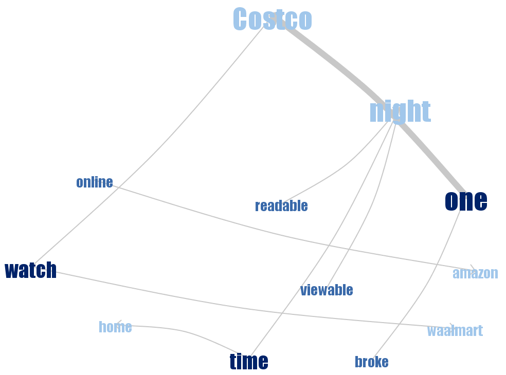

Let us plot the scatterplots of pairs of variables in the data file `protein.txt`.

```{r,echo = FALSE,message=FALSE,warning=FALSE}
library(ggplot2)
library(seriation)
library(RColorBrewer)
#library(slam)
#library(tm)
#library(wordcloud)
prodata <- read.delim("protein.txt")
pairs(prodata, panel = panel.smooth,pch = "+")
```

We see that it is a bit hard to interpret the correlations in data, even with a smoother line. Possibly we could say that nuts and fruit & vegetables are positively correlated, as are white meat and eggs. Other than that, it is difficult to say.

We instead plot a heatmap of the data with rows unpermuted to see if we can say more from that. The numbers of the Countries are given.

```{r, echo=FALSE}
proscaled <- as.matrix(scale(prodata[,2:10]))
heatmap(proscaled, Rowv = NA, scale = "none",
        col = cm.colors(256))
as.character(prodata[,1])
```

Still not very clear if you ask me. Let us try actually using some hierachial clustering.

```{r,echo = FALSE}
heatmap(proscaled, Rowv = NULL, scale = "none",
        col = cm.colors(256))
```

Now it looks like we have two main clusters. The northwestern industrial nations of Europe and the south eastern then communist hell-holes. I would say milk and red meat variables characterize the former while nuts and cereals are the hallmark of the latter.

Let us perform Anti-robinson unweighted seriation and PCA seriations, let us then present the corresponding heatmaps and comment about the clusters.

```{r, echo = FALSE}
rowdist<-dist(proscaled)
coldist<-dist(t(proscaled))

order1<-seriate(rowdist, "BBURCG")
order2<-seriate(coldist, "BBURCG")
ord1<-get_order(order1)
ord2<-get_order(order2)
reordmatr<-proscaled[rev(ord1),ord2]
heatmap(reordmatr, Colv=NA, Rowv=NA,
        labRow = prodata[rev(ord1),1],
        col=cm.colors(256))

order3<-seriate(proscaled, "PCA")
order4<-seriate(t(proscaled), "PCA")
ord3<-get_order(order3)
ord4<-get_order(order4)
reordmatr2<-proscaled[rev(ord3),ord4]
heatmap(reordmatr2, Colv=NA, Rowv=NA,
        labRow = prodata[rev(ord3),1],
        col=cm.colors(256))
```

It looks like the two seriation techniques backup the clusterings found in the hierarchial clustering heatmap. In PCA seriation Eggs emerge as important variable for the first cluster, the same variable we saw correlated with white meat in the scatterplot pairs.

We download reviews of casio watch from amazon, the first group negative and the second group positive and make wordclouds about them.


One can see that the word most common is naturally watch. The negative review wordcloud has some content of "defective", "stopped","problem" and "battery" while the positive review wordcloud uses "great","like","love" and "band".

Now we make phrase-nets for the two review groups with the link words

* am,is,are,was,were
* a,the
* at
* of

First for the positive reviews





Then we do it for the negative reviews


As we can see, there is some difference between the two groups, for instance the phrase "I am looking" is much more common among the positive reviews while "Piece of junk" is more common among negative reviews. Both groups appear to be talking about the battery and something about replacement of either watch or battery. The stores Costco is mentioned by positive reviewers and Amazon by the negative reviewers.


The word tree site seems to suggest that some negative reviewers actually would have given a good review if not for some minor thing that irked them.

##Appendix

```{r,echo=FALSE}
# data<-read.table("OneTwo.txt",header=F, sep='\n') #Read file
# mycorpus <- Corpus(DataframeSource(data)) #Creating corpus (collection of text data)
# mycorpus <- tm_map(mycorpus, removePunctuation)
# mycorpus <- tm_map(mycorpus, function(x) removeWords(x, stopwords("english")))
# tdm <- TermDocumentMatrix(mycorpus) #Creating term-document matrix
# m <- as.matrix(tdm)
# v <- sort(rowSums(m),decreasing=TRUE) #Sum up the frequencies of each word
# d <- data.frame(word = names(v),freq=v) #Create one column=names,second=frequences
# pal <- brewer.pal(6,"Dark2")
# pal <- pal[-(1:2)] #Create palette of colors
# wordcloud(d$word,d$freq, scale=c(8,.3),min.freq=2,max.words=100, random.order=F,
#           rot.per=.15, colors=pal, vfont=c("sans serif","plain"))
# 
# data2<-read.table("Five.txt",header=F, sep='\n') #Read file
# mycorpus2 <- Corpus(DataframeSource(data2)) #Creating corpus (collection of text data)
# mycorpus2 <- tm_map(mycorpus2, removePunctuation)
# mycorpus2 <- tm_map(mycorpus2, function(x) removeWords(x, stopwords("english")))
# tdm2 <- TermDocumentMatrix(mycorpus2) #Creating term-document matrix
# m2 <- as.matrix(tdm2)
# v2 <- sort(rowSums(m2),decreasing=TRUE) #Sum up the frequencies of each word
# d2 <- data.frame(word = names(v2),freq=v2) #Create one column=names,second=frequences
# wordcloud(d2$word,d2$freq, scale=c(8,.3),min.freq=2,max.words=100, random.order=F,
#           rot.per=.15, colors=pal, vfont=c("sans serif","plain"))
```

###R code
```{r code=readLines(knitr::purl("C:/Users/Dator/Documents/R_HW/visualization/Thomas_Zhang_Lab3.Rmd", documentation = 0)), eval = FALSE}


